# Smart Rockets

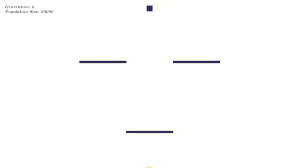

## Algoritmos Evolutivos e Threading

* * *

**SSC0140 - Sistemas Operacionais**

Prof. Dr. Jó Ueyama

**Nome:** Caroline Jesuíno Nunes da Silva **NUSP:** 9293925

**Nome:** Felipe Scrochio Custódio **NUSP:** 9442688

* * *

# Introdução

Uma rápida introdução a este relatório: pretendemos dar uma visão geral do problema que tentamos resolver, explicando o algoritmo evolutivo desenvolvido e os problemas encontrados ao tentar implementar versões sequenciais e com threads, comparando seus desempenhos.

Por ter sido um trabalho relativamente complexo e longo, o relatório também ficou longo. Gostaríamos de ressaltar que a seção mais importante no contexto de Sistemas Operacionais é a **Threads! Uma solução mágica?**, onde mostramos os problemas encontrados, os desafios para resolvê-los e a solução final.

Como existe bastante código e várias imagens, optamos por subir o projeto em um repositório no Github.

[https://github.com/felipecustodio/smart-rockets](https://github.com/felipecustodio/smart-rockets)

Existem três implementações do algoritmo:

**smartrocketsseq** - Versão sequencial

**smartrocketsthread** - Versão com threads

**smartrocketsvis** - Versão usada para gerar as animações

Para executar o programa, basta baixar o ambiente Processing ([https://processing.org/download/](https://processing.org/download/)) e abrir os arquivos _.pde_ com ele.

O código fonte está implementado em linguagem Java.

# Definição do problema

Como indivíduos aleatoriamente gerados podem chegar até um objetivo não colidindo com obstáculos?

O problema abordado no nosso trabalho é exatamente esse: uma população de foguetes possui um motor que aplica forças de formas aleatórias em seus corpos e um ponto final onde devem pousar; mas há paredes entre eles e o ponto final e elas precisam ser contornadas. Após as primeiras falhas, a ideia é que nossos indivíduos consigam evoluir e ficar mais inteligentes. Mas como?

# Algoritmo Evolutivo _Smart Rockets_

A solução para esse problema é relativamente simples: um algoritmo evolutivo.

Este tipo de abordagem é bastante utilizada quando não há conhecimento prévio sobre o estado do problema ou quando a complexidade dele é muito alta; tanto é que uma de suas aplicações para estudo mais comuns é a solução do Caixeiro Viajante com muitas cidades.

Além disso, a abordagem genética costuma ser muito bem usada quando necessita-se de uma otimização de algum tipo, que seria complicada de fazer de outra forma: por exemplo, o algoritmo evolutivo costuma ser excelente para ajustar os pesos de redes neurais.

A melhor parte disso tudo, é sua simplicidade em todos os passos: o princípio é fazer com que os indivíduos mais aptos gerem descendentes, que se tornarão aptos e farão o mesmo para as próximas gerações. Esses indivíduos serão colocados em uma _mating pool_, uma piscina genética, de onde serão sorteados os pares reprodutivos.

Isso é feito calculando uma nota para cada indivíduo, que, no nosso caso é dada pelo inverso da distância ao alvo dividida pelo tempo de fim e, ao final, elevada à quarta para que o resultado fique exponencial; além disso, se o indivíduo consegue chegar no alvo, a sua nota é dobrada; e se colide com alguma parede, perde 90% da nota. Essa função é assim porque damos importância tanto para a chegada ao objetivo quanto para o caminho feito (não deve haver colisões).

É importante ressaltar que cada algoritmo genético calculará o valor dessa pontuação com base nas variáveis que mais importam para a solução do problema.

Os indivíduos considerados mais aptos por essa função recebem mais bilhetes para entrar na _mating pool_, que representam proporcionalmente suas chances de se reproduzir. Assim, garantimos que os genes melhores continuem se propagando para a próxima geração.

Há muitos métodos de reprodução nessa área: o torneio de dois faz com que candidatos se enfrentem, vencendo o mais apto, para decidir quem tem o direito de reprodução; no método elitista, apenas o melhor classificado se reproduz com todos os outros indivíduos; no método da roleta, a nota do indivíduo é proporcional à probabilidade de ele ser escolhido para a reprodução.

No nosso caso, o método de reprodução escolhido foi o crossover, em que se utiliza parte dos genes da mãe e parte dos genes do pai para gerar o filho. Além disso, quando o código genético do filho está pronto, há a chance de existir uma mutação, que alteraria um campo do código genético para algo novo.

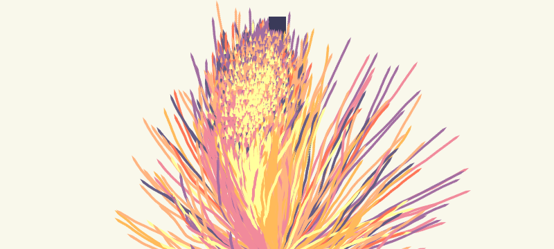

Mutações são benéficas nesse tipo de algoritmo porque tende a aumentar a variabilidade genética, o que faz com que o algoritmo seja menos propício a travar em um máximo local e nunca atingir o objetivo requerido.

Um problema da configuração escolhida por nós é que, quando o número de indivíduos é muito alto, o custo em termos de tempo passa a ser muito alto se o algoritmo for rodado sequencialmente. É aí que entra o tema do nosso trabalho.

# O ambiente Processing

O ambiente Processing (<u>https://processing.org/download/</u>) é uma linguagem de programação para o contexto de artes visuais. É implementado em cima da linguagem Java, através de um pré-processador.

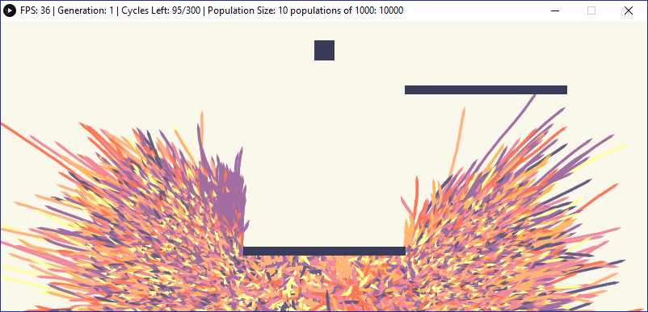

Todo _sketch_ Processing é composto de duas funções principais: setup e draw.

Setup é onde é feito todo o pré-processamento: criação do canvas de desenho, tamanho da janela, carregar dados necessários, etc.

Draw é o loop de desenho. Essa função roda indefinidamente renderizando quaisquer instruções de desenho dentro dela, até o programa ser fechado.

Não é possível fazer qualquer tipo de desenho intermediário, o que gerou problemas no nosso trabalho. A função draw só renderiza um quadro na janela criada quando ela chega ao fim, ou seja, se um loop ocorrer no meio dela, o quadro só será exibido na tela quando o loop terminar.

# Threads! Uma solução mágica?

A nossa ideia foi utilizar threads para rodar populações pequenas de forma paralela. Como populações pequenas rodam rápido, se elas puderem rodar paralelamente, poderíamos reduzir nossa complexidade que é de O(N * M), tal que N é o número de indivíduos e M o número de populações, para O(N), o que pode ser bastante impressionante para um M alto.

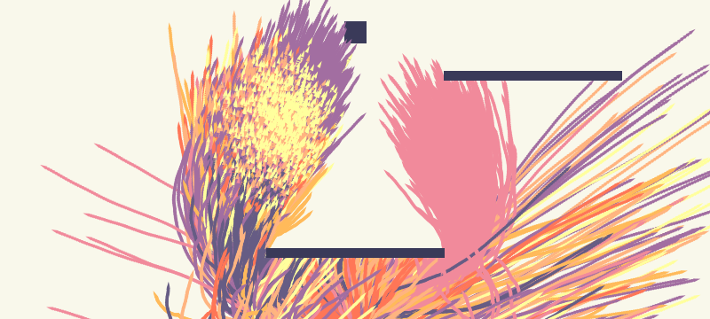

Assim, nós poderíamos comparar a diferença de tempo através de uma visualização gráfica: nós “desenharíamos” os indivíduos evoluindo a cada geração e, por isso, provavelmente teríamos uma diferença da qualidade de animação entre as implementações com e sem _threads_, já que aquelas rodariam mais rápido que estas.

Nosso algoritmo é rodado até que 50% dos indivíduos de uma população atinjam o alvo. Toda vez que uma atinge esse critério, um contador global é incrementado. Quando todas as populações atingem o objetivo, a execução é encerrada.

A expectativa de melhora seria em relação também ao tempo de execução. Usando o método sequencial, cada população seria executada até atingir o objetivo, uma atrás da outra.

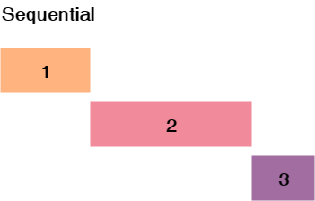

Isso resultaria em um tempo de execução 1 + 2 + 3 . Pensamos que, utilizando uma thread para cada população, poderíamos reduzir esse tempo e obter uma melhora de desempenho, sendo limitado pelo tempo de execução da população mais demorada.

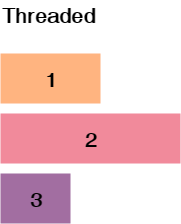

Infelizmente, nossas expectativas estavam incorretas e o aumento de desempenho não ocorreu, mas acreditamos que a explicação se encaixa perfeitamente na parte teórica das disciplinas dessa trilha.

Caímos em vários problemas de desenvolvimento que foram bem desafiadores, queremos mostrá-los e explicar como chegamos em suas respectivas soluções.

## Arquitetura das classes implementadas

Fizemos um diagrama para ficar mais fácil de acompanhar, apenas com as classes e métodos relevantes aos tópicos que serão discutidos. É possível ver tudo com mais detalhes na implementação em código.

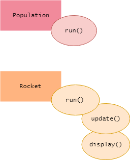

A população possui um método _run_, que executa até o objetivo ser atingido.

Na versão sequencial, todas as populações são executadas em sequência, utilizando um laço _for_. Já na versão com threads, todas as threads de população são lançadas e um _while_ aguarda o contador global chegar ao número de populações.

Os foguetes possuem um método _display_, para renderizá-los na tela, e um método _update_ que aplica as forças.

## Métrica de quadros por segundo

A diferença entre as animações não era visível porque, como foi explicado na seção sobre o ambiente Processing, nós não conseguimos renderizar nada enquanto a função _draw_ não chega ao fim. Basicamente, o programa é limitado pelo loop de desenho. Quando soltamos as _threads_ das populações, a animação ficava completamente errada e cheia de defeitos gráficos, pois a função _run_ de cada população chamava as funções de _display_ do foguete, que não se sincronizavam nem com o loop de desenho nem uns com os outros. Ao fazer um _join_ para aguardar a execução da função de desenho dos foguetes, o desempenho em quadros por segundo era o mesmo tanto para a versão com _threads_ quanto para a versão sequencial.

O que fizemos então foi rodar todo o algoritmo antes, no setup, e fazer a visualização depois.

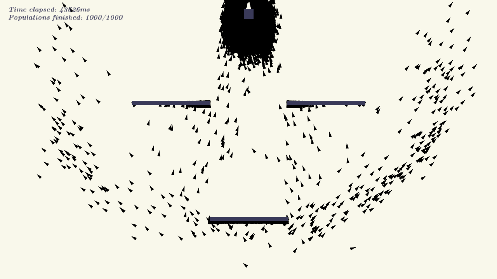

## Contador global

O segundo grande problema que encontramos foi com o contador global. Seu comportamento estava muito estranho: seu valor não mudava na função _setup_, mas mudava dentro das funções _run_ das populações, que o alteravam. Quando colocávamos um _println_ dentro do while, porém, o valor era observado corretamente. Ou seja, precisávamos trazer a variável para o escopo do while para o código funcionar.

Depois de muito quebrar a cabeça, percebemos que era um problema de cacheamento de threads. Cada thread tem seu espaço de memória, portanto, cada uma estava com o seu contador, em sua cache de thread, alterando o valor apenas em seu escopo, e não no contador global para a função _setup_ ver.

O contador global esperando as threads terminarem nada mais foi do que uma tentativa de implementar uma barreira de sincronização manualmente. Existem diversas implementações diferentes, em Java poderíamos ter usado CyclicBarrier ou CountdownLatch, em vez de manipular o contador dentro de uma região crítica manualmente, o que não foi uma boa ideia.

A solução foi usar o tipo **volatile**, que garante visibilidade da variável em todas as threads, sendo armazenada no espaço de memória principal do programa, ou seja, realmente se tornando uma variável global, em vez de ficar na cache da CPU.

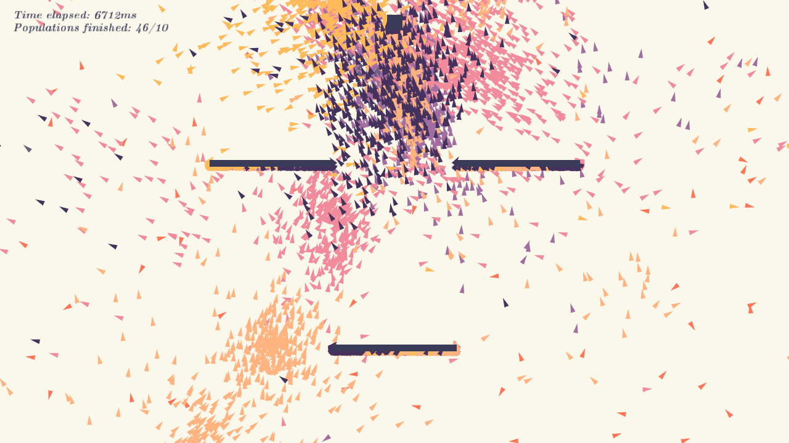

## Lei de Amdahl

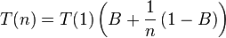

Outra limitação da abordagem de utilizar threads e rodar as populações em paralelo veio da Lei de Amdahl. Em um computador ideal, onde apenas nosso algoritmo estaria sendo executado, talvez a expectativa demonstrada nos diagramas se concretizasse. Porém, estamos competindo pelos recursos computacionais com dezenas ou até centenas de outros processos, e também estamos utilizando uma região compartilhada de memória, com diversos acessos e escritas que levam a esperas.

Quando tarefas concorrentes acessam dados umas das outras, suas caches são liberadas, o que contribui mais ainda para esperas.

Sentimos na prática os efeitos da Lei de Amdahl, não obtendo o _speedup_ esperado, pelo contrário, obtivemos um desempenho muito pior com a versão threaded.

## Problemas do algoritmo

Há alguns problemas inerentes à arquitetura do Algoritmo Genético que utilizamos.

A primeira delas é que quando começamos toda uma população como tendo características aleatórias, precisamos de sorte para que suas configurações não sejam muito ruins. Assim, tendo sorte, chegaremos no fim mais rápido; tendo azar, demoraremos mais.

Além disso há outros fatores que influenciam na velocidade de encontro da solução, por exemplo: quanto maior a população, normalmente, mais rápida a convergência para o resultado que queremos.

Há também o problema de enviesamento: se as mutações não se concretizarem e os indivíduos aleatórios forem parecidos entre si, a tendência da população é estagnar num meio termo. Isso pode ser contornado com técnicas como o uso de taxas de mutação variáveis para cada população, mas como o mais importante para nós era o caminho do algoritmo até uma solução e não a solução em si, descartamos essa possibilidade.

# Comparação de desempenho

Fizemos 100 testes para obter os tempos. Aumentamos o número de populações a cada teste. Cada população possui 90 indivíduos. Isso significa percorrer todas as populações e todos os foguetes de cada população diversas vezes. O maior teste foi com 90.000 indivíduos no total e pode ser visto no vídeo, o resultado é bem impressionante visualmente.

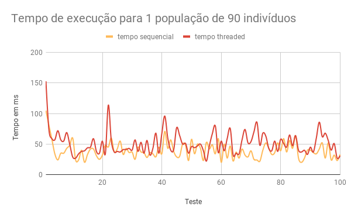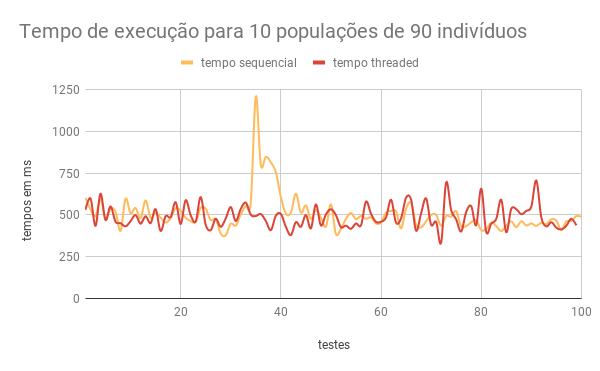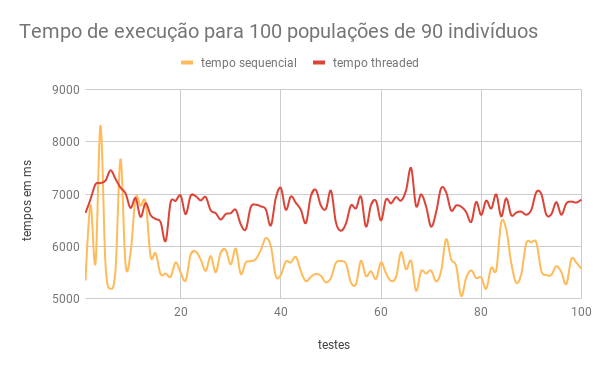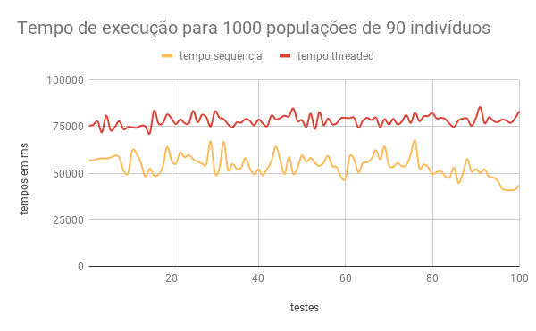

Como podemos observar, após os tópicos discutidos acima e os resultados obtidos, esse não foi um problema facilmente paralelizável e perdemos muito desempenho utilizando as threads para as populações ao invés de percorrê-las sequencialmente.

# Usando threads para salvar quadros

Apesar dos problemas de desempenho obtidos no algoritmo, o uso de threads separadas foi muito útil em outro problema: salvar quadros da animação em imagens no disco.

Para conseguir gerar GIFs e vídeos do algoritmo em execução, precisamos renderizar os quadros da animação e salvar em arquivos. Durante o ciclo de desenho, isso causa um grande atraso, pois após o quadro ser renderizado e exibido, é preciso esperar todo o procedimento de salvar em arquivo, que é demorado.

Nesse caso, threads são muito úteis, pois toda a simulação pode continuar sendo executada independentemente do quadro estar sendo salvo em arquivo. Portanto, estendemos a classe **PImage** do Processing, adicionando **Runnable**. O processo de salvar um quadro em arquivo é então feito por outra thread, sem interferir no desempenho da visualização.

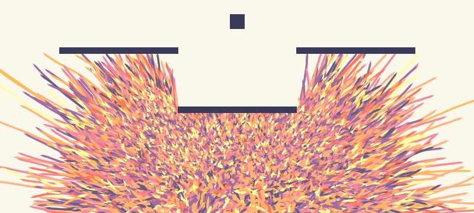 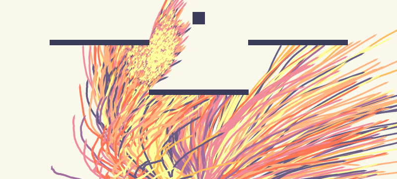
